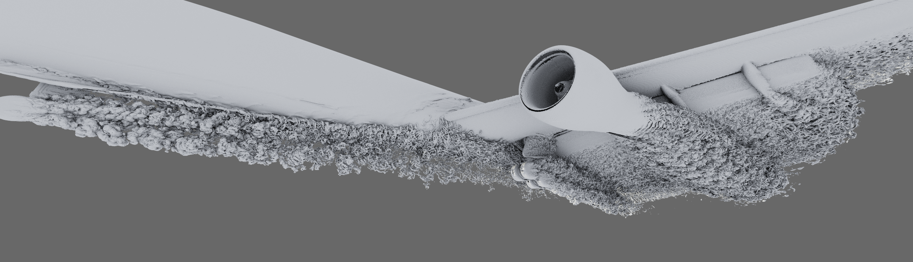

# cudaAmrIsoSurfaceExtraction: Sample code for our CUDA AMR Dual-Mesh Generation / Iso-Surface Extraction Paper

This repository serves as auxiliary material / sample code for the
algorithm/method presented in the following paper:

Ingo Wald, "A Simple, General, and GPU Friendly Method for Computing
Dual Mesh and Iso-Surfaces of Adaptive Mesh Refinement (AMR) Data",
2020, ArXiv (number TBD).

